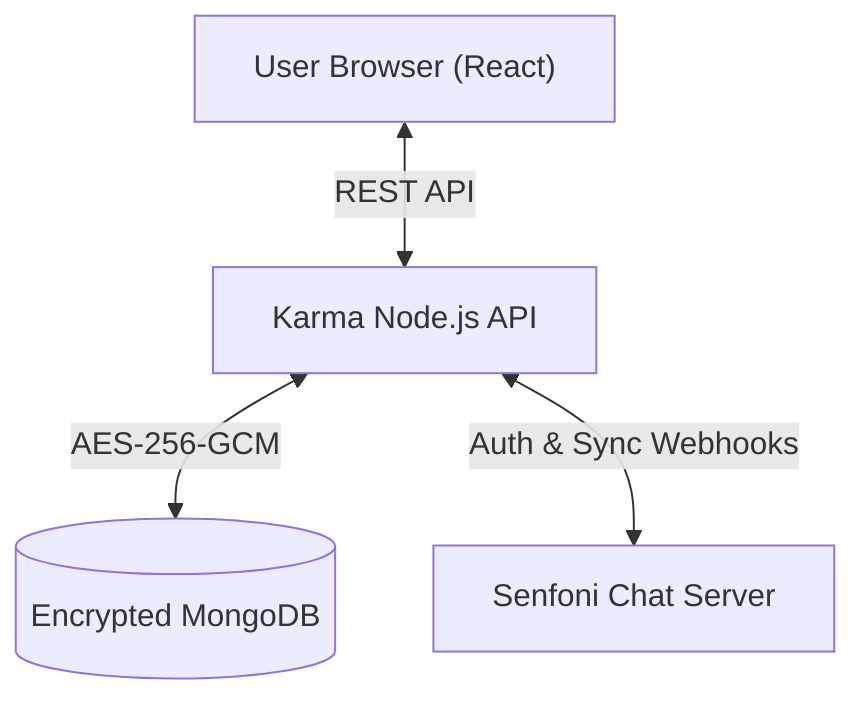

<div align="center">
  <h1>🚀 Senfoni Karma</h1>
  <p><strong>Secure & Encrypted Team Management Dashboard</strong></p>
  <p>
    
    
    
    
  </p>
</div>

<br />

**Senfoni Karma** is a modern, encrypted Kanban and Team Management platform designed to seamlessly integrate with **Senfoni Chat**. It provides a secure environment for task tracking, team communication, and project oversight, ensuring that all sensitive operational data is encrypted at rest.

## ✨ Core Features

*   🔐 **AES-256-GCM Encryption at Rest:** Task titles, descriptions, reports, team names, and notifications are securely encrypted in the MongoDB database. Even in the event of a database breach, your operational data remains unreadable.
*   🔄 **Senfoni Chat Integration:** Karma uses your Senfoni Chat API Key for authentication. It automatically syncs users and roles from your Senfoni Chat instance via secure internal Docker webhooks.
*   📋 **Advanced Kanban Board:** Track tasks across states (`Todo`, `In Progress`, `Review`, `Done`). 
*   🛡️ **Strict Review Workflow:** When users submit reports/files for a task, it automatically moves to the `Review` column instead of `Done`, ensuring managers can verify work before final approval.
*   📱 **Mobile-First Responsive UI:** A fully responsive interface with a side-drawer navigation menu and a native app-like bottom bar for mobile users.
*   📊 **Real-time Dashboard:** Track project velocity, active members, and late tasks with an elegant grid interface.

---

## 🏗️ Architecture



---

## 🚀 Quick Start Guide

### 1. Prerequisites

*   **Node.js 18+**
*   **MongoDB** (running locally or via Docker)
*   **Senfoni Chat** (running on the same Docker network for auth sync)

### 2. Installation

```bash
git clone https://github.com/mefkuz/senfoni-karma.git
cd senfoni-karma
npm install
cd server && npm install && cd ..
```

### 3. Environment Configuration

Create a `.env` file in the `server` directory using the provided template:

```env
MONGO_URI=mongodb://localhost:27017/senfoni-karma
KARMA_ENCRYPTION_KEY=your-32-byte-secure-random-key
```

### 4. Running the Application

**Run Backend (Port 80 / 4040):**
```bash
cd server
npm start
```

**Run Frontend (Development):**
```bash
npm run dev
```

For production, build the frontend (`npm run build`) and the Node.js server will automatically serve the static `dist/` directory.

---

## 🔒 Security Posture

*   **Encryption Key:** Do not lose your `KARMA_ENCRYPTION_KEY`. If lost, all database records (tasks, teams, messages) will be permanently unreadable.
*   **Internal Network:** The webhook endpoint (`/api/members/by-username/:username`) used by Senfoni Chat to delete users is restricted to internal IP addresses (loopback and `172.x` Docker ranges) to prevent unauthorized tampering.

---
<div align="center">
  <p><i>Building secure workflows.</i></p>
</div>
